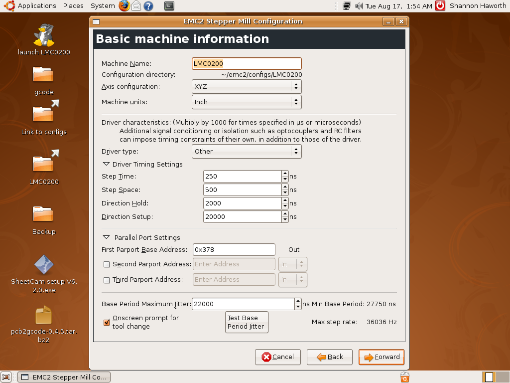

# EMC2 Configuration

## SpectraLight 0200 Parallel Port Control

## Configuration  

This page contains instructions concerning how to configure the EMC to work with the adapters from this site.

## Adapter Cable

These settings are valid for the Adapter Cable

 Basic machine settings:

[

Parallel port settings:

Axis configuration

 Click on images for full-size view.

