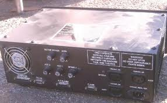

# Controller Pins

## SpectraLight 0200 Parallel Port Control

*   [Home](/site/)
*   [Adapter Cable](/site/spectralight0200parallelportadapter/)
*   [Adapter Board](/site/adapterboard/)
*   [control_box_internals](/site/controlboxinternals/)
*   [EMC2 Configuration](/site/emc2configuration/)
*   [Controller Pins](/site/reverseengineeringthecontroller/)
*   [Interface Card Pins](/site/spectralight0200protocol/)
*   [Unexpected clock](/site/strangeplacetoputaclock/)

# Electrical interface for the SpectraLight 0200 Controller

 This page documents the 25 pin connector on the SpectraLight 0200 controller box.  

<table border="0">

<tbody>

<tr>

<td>  
 Pin</td>

<td>Function  
</td>

<td>  
 Notes</td>

</tr>

<tr>

<td>  
 1</td>

<td>Accessory Input  
</td>

</tr>

<tr>

<td>  
 2</td>

<td>  
 Clamp Input  
</td>

</tr>

<tr>

<td>  
 3</td>

<td>  
 ??? (+5v)  
</td>

</tr>

<tr>

<td>  
 4</td>

<td>  
 Spindle Input  
</td>

</tr>

<tr>

<td>  
 5</td>

<td>  
 Z Dir Input  
</td>

</tr>

<tr>

<td>  
 6</td>

<td>  
 X Dir Input  
</td>

</tr>

<tr>

<td>  
 7</td>

<td>  
 GND</td>

</tr>

<tr>

<td>  
 8</td>

<td>  
 Y Dir Change Input  
</td>

</tr>

<tr>

<td>  
 9</td>

<td>  
 Z High Speed Input  
</td>

</tr>

<tr>

<td>  
 10</td>

<td>  
 ??? (0v)  
</td>

</tr>

<tr>

<td>  
 11</td>

<td>  
 Cover Open Output  
</td>

<td>+5v when cover is open  
</td>

</tr>

<tr>

<td>  
 12</td>

<td>  
 ??? (0v)  
</td>

</tr>

<tr>

<td>  
 13</td>

<td>  
 ??? (+5v)  
</td>

</tr>

<tr>

<td>  
 14</td>

<td>  
 X Dir Change Input  
</td>

</tr>

<tr>

<td>  
 15</td>

<td>  
 Robot 1 Input  
</td>

</tr>

<tr>

<td>  
 16</td>

<td>  
 Robot 2 Input  
</td>

</tr>

<tr>

<td>  
 17</td>

<td>  
 Mill Enable Input  
</td>

</tr>

<tr>

<td>  
 18</td>

<td>  
 Y Dir Input  
</td>

</tr>

<tr>

<td>  
 19</td>

<td>  
 Z Step Input  
</td>

</tr>

<tr>

<td>  
 20</td>

<td>  
 X Step Input  
</td>

</tr>

<tr>

<td>  
 21</td>

<td>  
 Y Step Input  
</td>

</tr>

<tr>

<td>  
 22</td>

<td>  
 Manual Mode Output  
</td>

<td>  
 +5v when the spidle is set to manual speed control.  
  Otherwise this pin functions as spindle enable input.</td>

</tr>

<tr>

<td>  
 23</td>

<td>  
 EStop / 25  
µs clock  
</td>

<td>  
 +5v Carrier with a pulse every 25  
µs, 0v with no pulse when the estop button is pressed  
</td>

</tr>

<tr>

<td>  
 24</td>

<td>  
 Limit Switch / 25  
µs clock  
</td>

<td>  
  +5v Carrier with a pulse every 25  
µs, 0v with no pulse when thelimit switch is activated  
</td>

</tr>

<tr>

<td>  
 25</td>

<td>  
 ??? (0v)</td>

</tr>

</tbody>

</table>

Note, your controller should look like the photo below from the back.  
  If it doesn't, this cable will not work.

