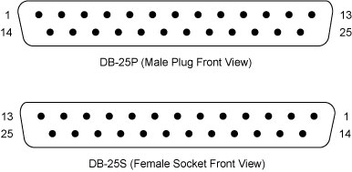

# Interface Card Pins

## SpectraLight 0200 Parallel Port Control

# Reverse engineering the SpectraLight 0200 ISA card

Electrical interface for the SpectraLight 0200 computer interface card (ISA bus).  

  

<table border="0">

<tbody>

<tr>

<td>

**Pin #  
**

</td>

<td>

**Function  
**

</td>

<td>

**  
 Notes**

</td>

</tr>

<tr>

<td>

 1

</td>

<td>

 Accessory on/off

</td>

<td>

 +5v turns the accessory on.

</td>

</tr>

<tr>

<td>

 2

</td>

<td>

 Clamp on/off

</td>

<td>

 +5v turns the clamp on.

</td>

</tr>

<tr>

<td>

 3

</td>

<td>

 ???

</td>

<td>

 +5v, Never changed

</td>

</tr>

<tr>

<td>

 4

</td>

<td>

 Spindle on/off

</td>

<td>

 +5v causes spindle to spin.

</td>

</tr>

<tr>

<td>

 5

</td>

<td>

 Z Direction

</td>

<td>

 Toggles between +5v and 0v to control direction of step.

</td>

</tr>

<tr>

<td>

 6

</td>

<td>

 X Direction

</td>

<td>

 Toggles between +5v and 0v to control direction of step.

</td>

</tr>

<tr>

<td>

 7

</td>

<td>

 ???

</td>

<td>

 +0v, Never changed

</td>

</tr>

<tr>

<td>

 8

</td>

<td>

 Y Dir change

</td>

<td>

 Normally this is held at +5v.  
  The signal is held low for 2.5ms when the Y direction is changed.

</td>

</tr>

<tr>

<td>

 9

</td>

<td>

 Z High Speed

</td>

<td>

 When the Z axis speed is set to a value greater than 2.5, this pin is pulled high.

</td>

</tr>

<tr>

<td>

 10

</td>

<td>

 ???

</td>

<td>

 +5v, Never changed

</td>

</tr>

<tr>

<td>

 11

</td>

<td>

 ???

</td>

<td>

 +5v, Never changed

</td>

</tr>

<tr>

<td>

 12

</td>

<td>

 ???

</td>

<td>

 +5v, Never changed

</td>

</tr>

<tr>

<td>

 13

</td>

<td>

 ???

</td>

<td>

 +5v, Never changed

</td>

</tr>

<tr>

<td>

 14

</td>

<td>

 X Dir Change

</td>

<td>

 Normally this is held at +5v.  
  The signal is held low for 2.5ms when the X direction is changed.

</td>

</tr>

<tr>

<td>

 15

</td>

<td>

 Robot 1

</td>

<td>

 +5v when this setting is set to "high", 0v normally

</td>

</tr>

<tr>

<td>

 16

</td>

<td>

 Robot 2

</td>

<td>

 +5v when this setting is set to "high", 0v normally

</td>

</tr>

<tr>

<td>

 17

</td>

<td>

 ???

</td>

<td>

 +5v, Never changed

</td>

</tr>

<tr>

<td>

 18

</td>

<td>

 Y Direction

</td>

<td>

 Toggles between +5v and 0v to control direction of step.

</td>

</tr>

<tr>

<td>

 19

</td>

<td>

 Z Axis Step

</td>

<td>

 Normally this is held at +5v.  
  The signal is held low for .25  
µs to trigger a step.

</td>

</tr>

<tr>

<td>

 20

</td>

<td>

 X Axis Step

</td>

<td>

 Normally this is held at +5v.  
  The signal is held low for .25  
µs to trigger a step.

</td>

</tr>

<tr>

<td>

 21

</td>

<td>

 Y Axis Step

</td>

<td>

 Normally this is held at +5v.  
  The signal is held low for .25  
µs to trigger a step.

</td>

</tr>

<tr>

<td>

 22

</td>

<td>

 ???

</td>

<td>

 +5v, Never changed

</td>

</tr>

<tr>

<td>

 23

</td>

<td>

 ???

</td>

<td>

 +5v, Never changed

</td>

</tr>

<tr>

<td>

 24

</td>

<td>

 ???

</td>

<td>

 +5v, Never changed

</td>

</tr>

<tr>

<td>

 25

</td>

<td>

 ???

</td>

<td>

 +5v, Never changed

</td>

</tr>

<tr>

<td>

 Notes:

*   I was unable to identify a Z Dir Change signal, I'm confident that my card isn't producing this signal.

</td>

</tr>

</tbody>

</table>

This table is incomplete. I did not search for the spindle speed control (I expect some form of PWM for spindle control). Also I did not attempt to identify inputs that the ISA card might accept.  
  My intent is to use manual spindle control initially.  
  I only expect the ISA card to accept three inputs.  
  One for the "cover open" switch, one for the Z limit switch and one for the big red "stop" switch.  
  Since I desire limit switches for each direction of travel I will require at least eight inputs - the existing inputs are of no use to me.  

* * *

### It works!  
  Learn more on [this page](../spectralight0200parallelportadapter/).

<form name="mcc_bottom" method="post" action=""><input type="hidden" name="post_modulecode" value="meshcmsmodule_bottom"> <input type="hidden" name="delId" value=""> <input type="hidden" name="showId" value=""> <input type="hidden" name="hideId" value="">

Lessons

Some additional pins for you:

For safety switches, high indicates go condition, low indicates switch is tripped.

Pin 11 = Cover closed switch

Pin  23 = E-stop switch

Pin 24 = Z limit switch

I believe the pin 22 you have tied to pin 17 is the machine on toggle; machine powers up if pin 22 is high, could probably set this up in EMC to match up with the machine on button.

-Joel

Shannon Haworth

I tried to implement pins 23 and 24, however I ran into this issue:  http://build.spaceopera.org/site/strangeplacetoputaclock/index.html.

How very strange, and effective.

I may end up building a "complete" adapter around a microprocessor such as the attiny2313.  I could filter out things like the clock pulses which EMC would reasonably believe indicated the switch had been thrown.

Shannon

Al Cassista

Hello again Shannon,

I am currently looking for a parrallel cable that I can modify to try this conversion on my lathe. I did submit some pictures of the inside of my control box which internally is quite different from the on you have pictured. I'm hoping that LightMachines did not change the pinouts when they changed control box internals. When you have a chance, please take a quick look at the pictures I sent you and I would appreciate any help you might be able to provide.

Thanks again for your help!

Al

